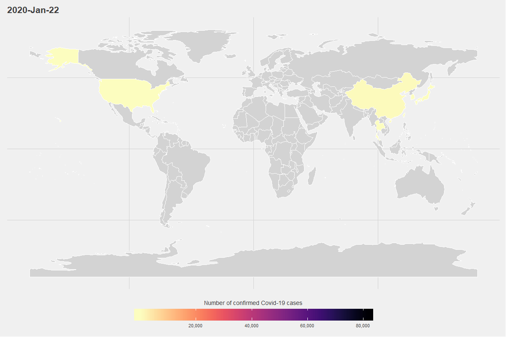
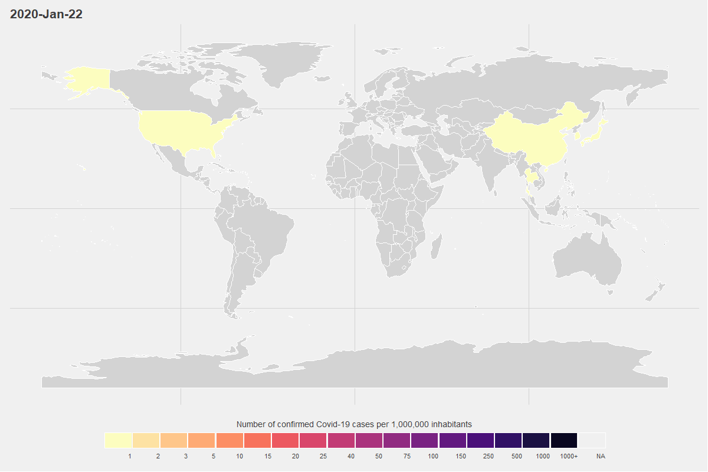

This file will show you how the create an animated choropleth map showing the spreading of the 2020 Covid-19 outbreak. It uses the most up-to-date data from Johns Hopkins University and the `gganimate` package to animate the data.


### Packages


```r
library(tidyverse)
library(lubridate)
library(ggthemes)
library(rworldmap)
library(countrycode)
library(gganimate)
library(wbstats)
library(viridis)
```


### Set System Language


```r
Sys.setlocale("LC_TIME", "C")
```

```
## [1] "C"
```

### Data

First we scrape the data on the number of cases per day per country from the  Johns Hopkins University (https://github.com/CSSEGISandData/COVID-19)


```r
url <- "https://raw.githubusercontent.com/CSSEGISandData/COVID-19/master/csse_covid_19_data/csse_covid_19_time_series/time_series_covid19_confirmed_global.csv"

dat <- read_csv(file = url) 
```

```
## Parsed with column specification:
## cols(
##   .default = col_double(),
##   `Province/State` = col_character(),
##   `Country/Region` = col_character()
## )
```

```
## See spec(...) for full column specifications.
```


To calculate cases per capita, we use the World Bank's latest data on population data. For this we use the `wbstats` package.


```r
pop_data <- wb(indicator = "SP.POP.TOTL", startdate = 2018, enddate = 2018) %>%
  select(iso3c, value)
```

### Data handling


```r
dat_long_format <- dat %>%
  select(-`Province/State`,-Lat, -Long) %>% # unselect some variables
  rename(Country = `Country/Region`) %>% # rename variables
  gather("date", "n_cases", -  Country) %>% # turn to long format
  group_by(Country, date) %>% # group by date and country
  summarise(n_cases = sum(n_cases)) %>% # sum to country totals
  ungroup() %>%
  mutate(date = mdy(date)) %>% # change to actual date format
  arrange(Country, date) %>% # arrange  by date
  mutate(Country_code = countrycode(Country,  #go from country to country code
                                    origin = "country.name",
                                    destination = "iso3c")) %>% 
  mutate(Country_code = ifelse(Country == "Kosovo", "RKS", Country_code)) %>%
  filter(Country != "Diamond Princess") %>% # remove cruiseship caes
  left_join(pop_data,
            by = c("Country_code" = "iso3c")) %>% # Join WB data
  mutate(case_per_million = (n_cases /  value) * 1000000) %>% # calc cases per mil
  group_by(Country) %>%
  mutate(n_cases = ifelse(n_cases == 0, 
                          NA,
                          n_cases)) %>%
  mutate(case_per_million = ifelse(case_per_million == 0,
                                   NA, 
                                   case_per_million)) %>%
  ungroup()
```

```
## Warning in countrycode(Country, origin = "country.name", destination = "iso3c"): Some values were not matched unambiguously: Diamond Princess
```

### Get map data

I use the `rworldmap` package to load in a polygon from all countries and then `left_join` the Covid data to this map.  


```r
wmap <- getMap()
wmap <- spTransform(wmap, CRS("+proj=longlat")) # reproject
wmap_df <- fortify(wmap, region = "ISO3") %>%
  left_join(dat_long_format, 
            by = c('id' = 'Country_code')) 
```

Because some countries do not have any cases, but we do want them to be part of the map, we load the same map again, as background


```r
wmap_bg <- getMap()
wmap_bg <- spTransform(wmap_bg, CRS("+proj=longlat")) # reproject
wmap_bg_df <- fortify(wmap_bg, region = "ISO3")
```


### animate the data


```r
p1 <- ggplot() +
  geom_polygon(data = wmap_bg_df,
               aes(x = long,
                   y = lat,
                   group = group),
               col = "white",
               fill = "lightgrey") + 
  geom_polygon(data = filter(wmap_df, !is.na(Country)),
               aes(x = long,
                   y = lat,
                   group = group,
                   fill = n_cases),
               col = "white") +
  transition_time(date) +
  ease_aes('linear') +
  labs(title="{format(frame_time, '%Y-%b-%d')}", 
       x = NULL, 
       y = NULL)  +
  theme_fivethirtyeight(14,"Avenir")+
  theme(axis.text =  element_blank()) +
    scale_fill_viridis(
      na.value = "lightgrey",
      labels = scales::comma,
      option = "magma", 
      direction = -1,
      name = "Number of confirmed Covid-19 cases",
      guide = guide_colorbar(
        direction = "horizontal",
        barheight = unit(10, units = "mm"),
        barwidth = unit(200, units = "mm"),
        draw.ulim = F,
        title.position = 'top',
        title.hjust = 0.5,
        label.hjust = 0.5
      ))  
```


```r
animate(p1, 500, fps = 15, width = 1200, height = 800, end_pause = 45)
```

<!-- -->


### N cases per 1,000,000 inhabitants

It makes more sense to plot the number of cases as a percentage or as share of 1,000,000 inhabitants (using World Bank data), because large countries will have a larger number of absolute cases. It also makes sense to make  discrete scale instead of just continuous scale for this plot. Otherwise, certain small countries, with few cases (but as share of the population high number of cases), would be on the extreme end of the scale and other countries would be hard to distinguish. 


#### Manual breaks

These breaks might have to be changed in the future, or some rules could be written to create a better way to create bins.


```r
manual_breaks = c(0, 1, 2, 3, 5, 10, 15, 20, 25, 40, 50, 75, 100, 150, 250, 500, 1000, 10000000)
labels_manual = c(as.character(manual_breaks)[2:(length(manual_breaks)-1)], "1000+")
wmap_df$break_points <- cut(wmap_df$case_per_million,
                            breaks = manual_breaks,
                            include.lowest = T)
```


Now only a few things need to changed in the code to plot it with cases per 1,000,000 inhabitants


```r
p2 <- ggplot() +
  geom_polygon(data = wmap_bg_df,
               aes(x = long,
                   y = lat,
                   group = group),
               col = "white",
               fill = "lightgrey") + 
  geom_polygon(data = filter(wmap_df, !is.na(Country)),
               aes(x = long,
                   y = lat,
                   group = group,
                   fill = break_points),
               col = "white") +
  transition_time(date) +
  ease_aes('linear') +
  labs(title="{format(frame_time, '%Y-%b-%d')}", 
       x = NULL, 
       y = NULL)  +
  theme_fivethirtyeight(14,"Avenir")+
  theme(axis.text =  element_blank())  +
  scale_fill_manual(
    values = rev(magma(length(unique(wmap_df$break_points)))),
    name = "Number of confirmed Covid-19 cases per 1,000,000 inhabitants",
    drop = FALSE,
    labels = labels_manual,
    guide = guide_legend(
      direction = "horizontal",
      keyheight = unit(10, units = "mm"),
      keywidth = unit(300 / length(unique(wmap_df$break_points)), units = "mm"),
      title.position = 'top',
      title.hjust = 0.5,
      label.hjust = 1,
      nrow = 1,
      byrow = T,
      reverse = F,
      label.position = "bottom"
    )
  )
```


```r
animate(p2, 500, fps = 15, width = 1200, height = 800, end_pause = 45)
```

<!-- -->


